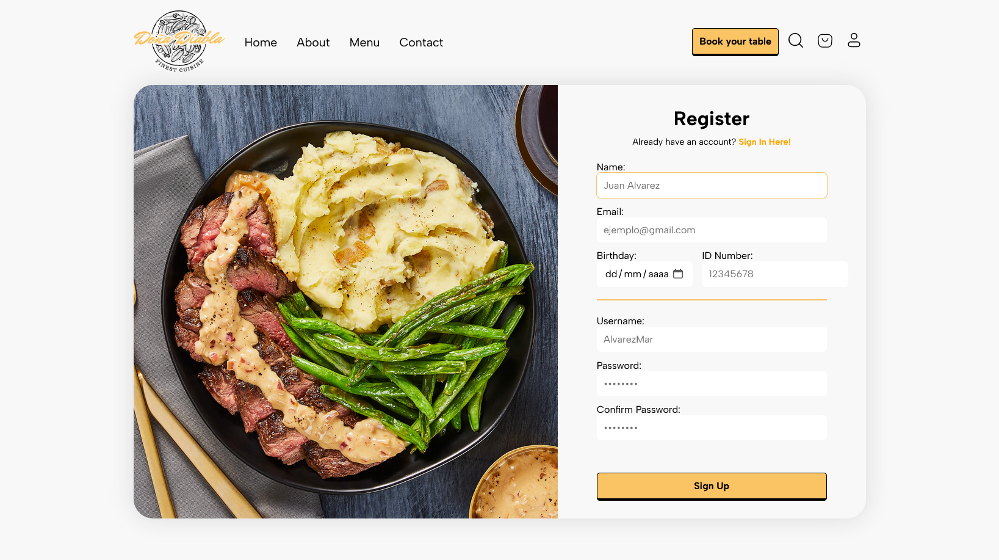

<h1>Doña Diabla</h1>

Doña Diabla is a proyect comprising two components. The back component offers a RESTful API for managing appointments and user data. Meanwhile, the front component provides an intuitive user interface, enabling users to interact seamlessly with the restaurant web and look over their appointments in a visually appealing format.


<h2>Instalation</h2>
To deploy the project locally, proceed as follows:

### Backend
1. Clone this repository to your local environment.
1. Navigate to the `back` directory.
2. execute the following commands to install dependencias and run the server:
```bash
npm i
npm start
```

### Frontend
1. Navigate to the `front` directory.
2. execute the following commands to install dependencias and launch vite application:
```bash
npm i
npm run dev
```
<h2>Usage</h2>

Once both applications are operational, access the frontend through your preferred web browser to begin interacting with the application. Doña Diabla offers a wide range of functionalities, including user authentication, registration, reservation scheduling, and account management.




<h2>Contribution</h2>

To contribute to this project, adhere to the following guidelines:
1. Fork the repository to your GitHub account.
2. Create a new branch (`git checkout -b feature/new-feature`).
4. Implement your changes and commit them (`git commit -m 'Add new feature'`).
5. Push the branch to your GitHub repository (`git push origin feature/new-feature`).
6. Open a new Pull Request to merge your changes into the main project.

<h2>Contact</h2>

For additional inquiries or information, feel free to reach out via email at [alvarez.majuan@hotmail.com](mailto:alvarez.majuan@hotmail.com).
